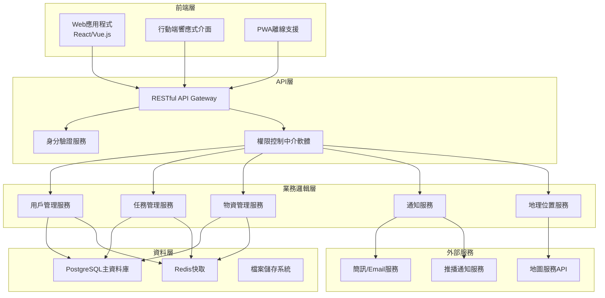
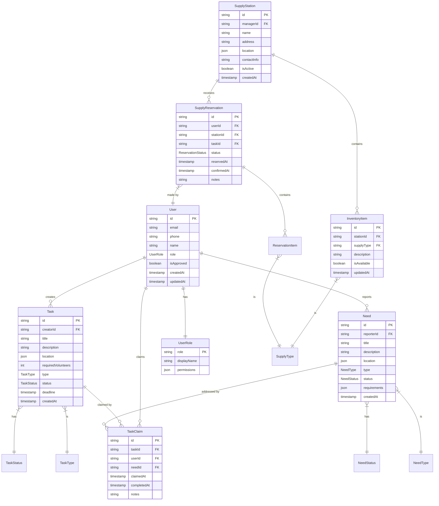

# 設計文件

## 概述

光復e互助平台是一個基於Web的災害應變管理系統，採用現代化的前後端分離架構。系統設計重點在於高可用性、易用性和快速響應，確保在災害情況下能夠穩定運行並提供即時的救災協調功能。

## 架構

### 系統架構圖



### 技術堆疊

**前端：**
- 框架：React.js 或 Vue.js
- UI庫：Ant Design 或 Element UI
- 狀態管理：Redux 或 Vuex
- 地圖：Leaflet.js 搭配 OpenStreetMap
- PWA：Service Worker 支援離線功能

**後端：**
- 框架：Python FastAPI
- 資料庫：Cloud SQL (PostgreSQL) + Cloud Memorystore (Redis)
- 身分驗證：JWT Token + Google Identity
- API文件：FastAPI 自動生成 OpenAPI/Swagger
- 檔案儲存：Google Cloud Storage

**基礎設施 (GCP)：**
- 運算：Cloud Run (容器化部署)
- 負載平衡：Cloud Load Balancing
- CDN：Cloud CDN
- 監控：Cloud Monitoring + Cloud Logging
- 安全：Cloud IAM + Cloud Armor

## 元件與介面

### 核心元件架構

#### 1. 用戶管理元件 (UserManagement)
```typescript
interface UserService {
  register(userData: UserRegistration): Promise<User>
  login(credentials: LoginCredentials): Promise<AuthToken>
  updateProfile(userId: string, profile: UserProfile): Promise<User>
  getUsersByRole(role: UserRole): Promise<User[]>
  approveOrganization(orgId: string): Promise<void>
}
```

#### 2. 任務管理元件 (TaskManagement)
```typescript
interface TaskService {
  createTask(task: TaskCreation): Promise<Task>
  getAvailableTasks(userRole: UserRole): Promise<Task[]>
  claimTask(taskId: string, userId: string): Promise<void>
  updateTaskStatus(taskId: string, status: TaskStatus): Promise<void>
  getTaskHistory(userId: string): Promise<Task[]>
}
```

#### 3. 物資管理元件 (SupplyManagement)
```typescript
interface SupplyService {
  createSupplyStation(station: SupplyStation): Promise<SupplyStation>
  updateInventory(stationId: string, items: InventoryItem[]): Promise<void>
  reserveSupplies(reservation: SupplyReservation): Promise<void>
  getSupplyMap(): Promise<SupplyStation[]>
  confirmPickup(reservationId: string): Promise<void>
}
```#### 4. 通知管
理元件 (NotificationManagement)
```typescript
interface NotificationService {
  sendNotification(notification: Notification): Promise<void>
  subscribeToUpdates(userId: string, topics: string[]): Promise<void>
  getNotificationHistory(userId: string): Promise<Notification[]>
  markAsRead(notificationId: string): Promise<void>
}
```

#### 5. 地理位置服務元件 (LocationService)
```typescript
interface LocationService {
  geocodeAddress(address: string): Promise<Coordinates>
  reverseGeocode(coordinates: Coordinates): Promise<Address>
  calculateDistance(from: Coordinates, to: Coordinates): Promise<number>
  findNearbyStations(location: Coordinates, radius: number): Promise<SupplyStation[]>
}
```

## 資料模型

### 核心實體關係圖



### 資料模型詳細定義

#### 用戶角色枚舉
```typescript
enum UserRole {
  ADMIN = 'admin',                    // 專案管理團隊
  VICTIM = 'victim',                  // 受災戶
  OFFICIAL_ORG = 'official_org',      // 正式志工組織
  UNOFFICIAL_ORG = 'unofficial_org',  // 非正式志工組織
  SUPPLY_MANAGER = 'supply_manager',  // 物資站點管理者
  VOLUNTEER = 'volunteer'             // 一般志工
}
```

#### 任務狀態枚舉
```typescript
enum TaskStatus {
  PENDING = 'pending',        // 待審核（非正式組織）
  AVAILABLE = 'available',    // 可認領
  CLAIMED = 'claimed',        // 已認領
  IN_PROGRESS = 'in_progress', // 執行中
  COMPLETED = 'completed',    // 已完成
  CANCELLED = 'cancelled'     // 已取消
}
```

#### 需求狀態枚舉
```typescript
enum NeedStatus {
  OPEN = 'open',           // 待處理
  ASSIGNED = 'assigned',   // 已分配
  IN_PROGRESS = 'in_progress', // 處理中
  RESOLVED = 'resolved',   // 已解決
  CLOSED = 'closed'        // 已關閉
}
```#
# 錯誤處理

### 錯誤分類與處理策略

#### 1. 用戶輸入錯誤 (4xx)
- **400 Bad Request**: 輸入資料格式錯誤
- **401 Unauthorized**: 身分驗證失敗
- **403 Forbidden**: 權限不足
- **404 Not Found**: 資源不存在
- **409 Conflict**: 資料衝突（如重複認領任務）

**處理策略：**
```typescript
class ValidationError extends Error {
  constructor(
    public field: string,
    public message: string,
    public code: string
  ) {
    super(message);
  }
}

// 統一錯誤回應格式
interface ErrorResponse {
  error: {
    code: string;
    message: string;
    details?: any;
    timestamp: string;
  }
}
```

#### 2. 系統錯誤 (5xx)
- **500 Internal Server Error**: 伺服器內部錯誤
- **502 Bad Gateway**: 外部服務錯誤
- **503 Service Unavailable**: 服務暫時不可用

**處理策略：**
- 實作重試機制（指數退避）
- 熔斷器模式防止級聯失敗
- 優雅降級（如地圖服務失效時使用文字地址）

#### 3. 網路連線錯誤
**前端處理：**
```typescript
// Service Worker 離線支援
self.addEventListener('fetch', (event) => {
  if (event.request.url.includes('/api/')) {
    event.respondWith(
      fetch(event.request)
        .catch(() => caches.match(event.request))
    );
  }
});

// 自動重連機制
class NetworkManager {
  private retryQueue: Request[] = [];
  
  async executeWithRetry(request: Request, maxRetries = 3): Promise<Response> {
    for (let i = 0; i < maxRetries; i++) {
      try {
        return await fetch(request);
      } catch (error) {
        if (i === maxRetries - 1) {
          this.retryQueue.push(request);
          throw error;
        }
        await this.delay(Math.pow(2, i) * 1000);
      }
    }
  }
}
```

## 測試策略

### 測試金字塔架構

#### 1. 單元測試 (70%)
**範圍：**
- 業務邏輯函數
- 資料驗證
- 權限檢查
- 工具函數

**工具：**
- Jest (JavaScript/TypeScript)
- pytest (Python)

**範例：**
```typescript
describe('TaskService', () => {
  describe('createTask', () => {
    it('should create task for official organization', async () => {
      const user = createMockUser({ role: UserRole.OFFICIAL_ORG });
      const taskData = createMockTaskData();
      
      const result = await taskService.createTask(user.id, taskData);
      
      expect(result.status).toBe(TaskStatus.AVAILABLE);
      expect(result.creatorId).toBe(user.id);
    });
    
    it('should require approval for unofficial organization', async () => {
      const user = createMockUser({ role: UserRole.UNOFFICIAL_ORG });
      const taskData = createMockTaskData();
      
      const result = await taskService.createTask(user.id, taskData);
      
      expect(result.status).toBe(TaskStatus.PENDING);
    });
    
    it('should throw error for unauthorized user', async () => {
      const user = createMockUser({ role: UserRole.VICTIM });
      const taskData = createMockTaskData();
      
      await expect(taskService.createTask(user.id, taskData))
        .rejects.toThrow(PermissionError);
    });
  });
});
```

#### 2. 整合測試 (20%)
**範圍：**
- API端點測試
- 資料庫操作
- 外部服務整合

**工具：**
- Supertest (API測試)
- Testcontainers (資料庫測試)

#### 3. 端對端測試 (10%)
**範圍：**
- 完整用戶流程
- 跨瀏覽器相容性
- 行動裝置測試

**工具：**
- Playwright 或 Cypress
- BrowserStack (跨瀏覽器測試)

### 測試資料管理

```typescript
// 測試資料工廠
class TestDataFactory {
  static createUser(overrides?: Partial<User>): User {
    return {
      id: uuid(),
      email: 'test@example.com',
      name: '測試用戶',
      role: UserRole.VOLUNTEER,
      isApproved: true,
      createdAt: new Date(),
      updatedAt: new Date(),
      ...overrides
    };
  }
  
  static createTask(overrides?: Partial<Task>): Task {
    return {
      id: uuid(),
      creatorId: uuid(),
      title: '測試任務',
      description: '這是一個測試任務',
      location: { lat: 23.9739, lng: 121.6015 },
      requiredVolunteers: 5,
      type: TaskType.CLEANUP,
      status: TaskStatus.AVAILABLE,
      deadline: new Date(Date.now() + 86400000),
      createdAt: new Date(),
      ...overrides
    };
  }
}
```

### 效能測試

**負載測試：**
- 工具：Artillery.io 或 k6
- 目標：支援1000併發用戶
- 關鍵指標：回應時間 < 2秒，錯誤率 < 1%

**壓力測試：**
- 模擬災害高峰期使用量
- 測試系統在極限負載下的表現
- 驗證自動擴展機制
## 錯誤
處理

### 錯誤處理策略

#### 1. API 錯誤回應格式
```python
from pydantic import BaseModel
from typing import Optional, List

class ErrorResponse(BaseModel):
    error_code: str
    message: str
    details: Optional[dict] = None
    timestamp: str
    request_id: str

class ValidationErrorResponse(BaseModel):
    error_code: str = "VALIDATION_ERROR"
    message: str = "輸入資料驗證失敗"
    field_errors: List[dict]
    timestamp: str
    request_id: str
```

#### 2. 常見錯誤類型處理
- **驗證錯誤 (400)**: 使用 Pydantic 模型驗證，返回詳細的欄位錯誤資訊
- **權限錯誤 (403)**: 基於用戶角色的權限檢查失敗
- **資源不存在 (404)**: 請求的任務、用戶或物資站點不存在
- **衝突錯誤 (409)**: 任務已被認領、物資已被預訂等
- **伺服器錯誤 (500)**: 記錄詳細錯誤日誌，返回通用錯誤訊息

#### 3. 災害情況下的容錯機制
- **資料庫連線失敗**: 自動重試機制，降級到唯讀模式
- **外部服務失敗**: 地圖服務、通知服務的備援方案
- **網路不穩定**: 前端離線暫存，同步機制

## 測試策略

### 測試金字塔架構

#### 1. 單元測試 (70%)
```python
# 使用 pytest 進行單元測試
import pytest
from fastapi.testclient import TestClient
from app.services.task_service import TaskService

class TestTaskService:
    def test_create_task_success(self):
        # 測試任務創建成功情境
        pass
    
    def test_create_task_invalid_data(self):
        # 測試無效資料的錯誤處理
        pass
    
    def test_claim_task_permission_check(self):
        # 測試權限控制
        pass
```

#### 2. 整合測試 (20%)
```python
# 測試 API 端點和資料庫整合
class TestTaskAPI:
    def test_task_creation_workflow(self):
        # 測試完整的任務創建流程
        pass
    
    def test_supply_reservation_workflow(self):
        # 測試物資預訂完整流程
        pass
```

#### 3. 端對端測試 (10%)
- 使用 Playwright 或 Selenium 測試完整用戶流程
- 測試關鍵救災情境：需求發布 → 任務認領 → 物資配送 → 完成確認

### GCP 部署架構

#### Cloud Run 部署配置
```yaml
# cloudbuild.yaml
steps:
  - name: 'gcr.io/cloud-builders/docker'
    args: ['build', '-t', 'gcr.io/$PROJECT_ID/disaster-relief-api', '.']
  - name: 'gcr.io/cloud-builders/docker'
    args: ['push', 'gcr.io/$PROJECT_ID/disaster-relief-api']
  - name: 'gcr.io/cloud-builders/gcloud'
    args:
      - 'run'
      - 'deploy'
      - 'disaster-relief-api'
      - '--image'
      - 'gcr.io/$PROJECT_ID/disaster-relief-api'
      - '--region'
      - 'asia-east1'
      - '--platform'
      - 'managed'
      - '--allow-unauthenticated'
```

#### 環境變數配置
```python
# app/config.py
from pydantic import BaseSettings

class Settings(BaseSettings):
    # 資料庫設定
    database_url: str
    redis_url: str
    
    # GCP 設定
    gcp_project_id: str
    gcs_bucket_name: str
    
    # 安全設定
    jwt_secret_key: str
    jwt_algorithm: str = "HS256"
    
    # 外部服務
    google_maps_api_key: str
    line_notify_token: str
    
    class Config:
        env_file = ".env"
```

#### 監控與日誌
```python
# app/monitoring.py
import logging
from google.cloud import logging as cloud_logging

# 設定 Cloud Logging
client = cloud_logging.Client()
client.setup_logging()

# 自定義日誌格式
logger = logging.getLogger(__name__)

def log_user_action(user_id: str, action: str, details: dict):
    logger.info(
        f"User action: {action}",
        extra={
            "user_id": user_id,
            "action": action,
            "details": details,
            "labels": {"component": "user_activity"}
        }
    )
```
## 資料庫結構設
計

### PostgreSQL Schema 定義

#### 1. 用戶相關表格

```sql
-- 用戶角色表
CREATE TABLE user_roles (
    role VARCHAR(50) PRIMARY KEY,
    display_name VARCHAR(100) NOT NULL,
    permissions JSONB NOT NULL,
    created_at TIMESTAMP DEFAULT CURRENT_TIMESTAMP
);

-- 用戶表
CREATE TABLE users (
    id UUID PRIMARY KEY DEFAULT gen_random_uuid(),
    email VARCHAR(255) UNIQUE NOT NULL,
    phone VARCHAR(20),
    name VARCHAR(100) NOT NULL,
    password_hash VARCHAR(255) NOT NULL,
    role VARCHAR(50) NOT NULL REFERENCES user_roles(role),
    is_approved BOOLEAN DEFAULT FALSE,
    profile_data JSONB,
    created_at TIMESTAMP DEFAULT CURRENT_TIMESTAMP,
    updated_at TIMESTAMP DEFAULT CURRENT_TIMESTAMP
);

-- 組織資訊表（針對志工組織）
CREATE TABLE organizations (
    id UUID PRIMARY KEY DEFAULT gen_random_uuid(),
    user_id UUID NOT NULL REFERENCES users(id) ON DELETE CASCADE,
    organization_name VARCHAR(200) NOT NULL,
    organization_type VARCHAR(50) NOT NULL, -- 'official' or 'unofficial'
    contact_person VARCHAR(100),
    contact_phone VARCHAR(20),
    address TEXT,
    description TEXT,
    approval_status VARCHAR(20) DEFAULT 'pending', -- 'pending', 'approved', 'rejected'
    approved_by UUID REFERENCES users(id),
    approved_at TIMESTAMP,
    created_at TIMESTAMP DEFAULT CURRENT_TIMESTAMP
);
```

#### 2. 任務管理相關表格

```sql
-- 任務類型表
CREATE TABLE task_types (
    type VARCHAR(50) PRIMARY KEY,
    display_name VARCHAR(100) NOT NULL,
    description TEXT,
    icon VARCHAR(100)
);

-- 任務狀態表
CREATE TABLE task_statuses (
    status VARCHAR(50) PRIMARY KEY,
    display_name VARCHAR(100) NOT NULL,
    description TEXT
);

-- 任務表
CREATE TABLE tasks (
    id UUID PRIMARY KEY DEFAULT gen_random_uuid(),
    creator_id UUID NOT NULL REFERENCES users(id),
    title VARCHAR(200) NOT NULL,
    description TEXT NOT NULL,
    task_type VARCHAR(50) NOT NULL REFERENCES task_types(type),
    status VARCHAR(50) NOT NULL REFERENCES task_statuses(status) DEFAULT 'available',
    location_data JSONB NOT NULL, -- {address, coordinates, details}
    required_volunteers INTEGER DEFAULT 1,
    required_skills JSONB, -- 所需技能或資格
    deadline TIMESTAMP,
    priority_level INTEGER DEFAULT 1, -- 1-5, 5為最高優先級
    approval_status VARCHAR(20) DEFAULT 'approved', -- 'pending', 'approved', 'rejected'
    approved_by UUID REFERENCES users(id),
    approved_at TIMESTAMP,
    created_at TIMESTAMP DEFAULT CURRENT_TIMESTAMP,
    updated_at TIMESTAMP DEFAULT CURRENT_TIMESTAMP
);

-- 任務認領表
CREATE TABLE task_claims (
    id UUID PRIMARY KEY DEFAULT gen_random_uuid(),
    task_id UUID NOT NULL REFERENCES tasks(id) ON DELETE CASCADE,
    user_id UUID NOT NULL REFERENCES users(id),
    claimed_at TIMESTAMP DEFAULT CURRENT_TIMESTAMP,
    started_at TIMESTAMP,
    completed_at TIMESTAMP,
    notes TEXT,
    status VARCHAR(20) DEFAULT 'claimed', -- 'claimed', 'started', 'completed', 'cancelled'
    UNIQUE(task_id, user_id)
);
```

#### 3. 需求管理相關表格

```sql
-- 需求類型表
CREATE TABLE need_types (
    type VARCHAR(50) PRIMARY KEY,
    display_name VARCHAR(100) NOT NULL,
    description TEXT,
    icon VARCHAR(100)
);

-- 需求狀態表
CREATE TABLE need_statuses (
    status VARCHAR(50) PRIMARY KEY,
    display_name VARCHAR(100) NOT NULL,
    description TEXT
);

-- 受災戶需求表
CREATE TABLE needs (
    id UUID PRIMARY KEY DEFAULT gen_random_uuid(),
    reporter_id UUID NOT NULL REFERENCES users(id),
    title VARCHAR(200) NOT NULL,
    description TEXT NOT NULL,
    need_type VARCHAR(50) NOT NULL REFERENCES need_types(type),
    status VARCHAR(50) NOT NULL REFERENCES need_statuses(status) DEFAULT 'open',
    location_data JSONB NOT NULL, -- {address, coordinates, details}
    requirements JSONB NOT NULL, -- 具體需求清單
    urgency_level INTEGER DEFAULT 1, -- 1-5, 5為最緊急
    contact_info JSONB, -- 聯絡方式
    assigned_to UUID REFERENCES users(id), -- 分配給哪個志工/組織
    assigned_at TIMESTAMP,
    resolved_at TIMESTAMP,
    created_at TIMESTAMP DEFAULT CURRENT_TIMESTAMP,
    updated_at TIMESTAMP DEFAULT CURRENT_TIMESTAMP
);

-- 需求處理記錄表
CREATE TABLE need_assignments (
    id UUID PRIMARY KEY DEFAULT gen_random_uuid(),
    need_id UUID NOT NULL REFERENCES needs(id) ON DELETE CASCADE,
    task_id UUID REFERENCES tasks(id), -- 關聯的任務
    user_id UUID NOT NULL REFERENCES users(id),
    assigned_at TIMESTAMP DEFAULT CURRENT_TIMESTAMP,
    completed_at TIMESTAMP,
    notes TEXT,
    status VARCHAR(20) DEFAULT 'assigned' -- 'assigned', 'in_progress', 'completed'
);
```

#### 4. 物資管理相關表格

```sql
-- 物資類型表
CREATE TABLE supply_types (
    type VARCHAR(50) PRIMARY KEY,
    display_name VARCHAR(100) NOT NULL,
    category VARCHAR(50), -- 'food', 'medical', 'clothing', 'tools', etc.
    unit VARCHAR(20), -- 'piece', 'box', 'kg', 'liter', etc.
    description TEXT
);

-- 物資站點表
CREATE TABLE supply_stations (
    id UUID PRIMARY KEY DEFAULT gen_random_uuid(),
    manager_id UUID NOT NULL REFERENCES users(id),
    name VARCHAR(200) NOT NULL,
    address TEXT NOT NULL,
    location_data JSONB NOT NULL, -- {coordinates, details}
    contact_info JSONB NOT NULL, -- {phone, email, hours}
    capacity_info JSONB, -- 容量資訊
    is_active BOOLEAN DEFAULT TRUE,
    created_at TIMESTAMP DEFAULT CURRENT_TIMESTAMP,
    updated_at TIMESTAMP DEFAULT CURRENT_TIMESTAMP
);

-- 物資庫存表
CREATE TABLE inventory_items (
    id UUID PRIMARY KEY DEFAULT gen_random_uuid(),
    station_id UUID NOT NULL REFERENCES supply_stations(id) ON DELETE CASCADE,
    supply_type VARCHAR(50) NOT NULL REFERENCES supply_types(type),
    description TEXT,
    is_available BOOLEAN DEFAULT TRUE,
    notes TEXT, -- 額外說明（如保存期限、狀況等）
    updated_at TIMESTAMP DEFAULT CURRENT_TIMESTAMP,
    UNIQUE(station_id, supply_type)
);

-- 物資預訂狀態表
CREATE TABLE reservation_statuses (
    status VARCHAR(50) PRIMARY KEY,
    display_name VARCHAR(100) NOT NULL,
    description TEXT
);

-- 物資預訂表
CREATE TABLE supply_reservations (
    id UUID PRIMARY KEY DEFAULT gen_random_uuid(),
    user_id UUID NOT NULL REFERENCES users(id),
    station_id UUID NOT NULL REFERENCES supply_stations(id),
    task_id UUID REFERENCES tasks(id), -- 關聯的任務
    need_id UUID REFERENCES needs(id), -- 關聯的需求
    status VARCHAR(50) NOT NULL REFERENCES reservation_statuses(status) DEFAULT 'pending',
    reserved_at TIMESTAMP DEFAULT CURRENT_TIMESTAMP,
    confirmed_at TIMESTAMP,
    picked_up_at TIMESTAMP,
    delivered_at TIMESTAMP,
    notes TEXT
);

-- 預訂物資明細表
CREATE TABLE reservation_items (
    id UUID PRIMARY KEY DEFAULT gen_random_uuid(),
    reservation_id UUID NOT NULL REFERENCES supply_reservations(id) ON DELETE CASCADE,
    supply_type VARCHAR(50) NOT NULL REFERENCES supply_types(type),
    requested_quantity INTEGER DEFAULT 1,
    confirmed_quantity INTEGER,
    notes TEXT
);
```

#### 5. 系統管理相關表格

```sql
-- 系統公告表
CREATE TABLE announcements (
    id UUID PRIMARY KEY DEFAULT gen_random_uuid(),
    title VARCHAR(200) NOT NULL,
    content TEXT NOT NULL,
    announcement_type VARCHAR(50) DEFAULT 'general', -- 'emergency', 'general', 'maintenance'
    priority_level INTEGER DEFAULT 1,
    is_active BOOLEAN DEFAULT TRUE,
    target_roles JSONB, -- 目標用戶角色
    created_by UUID NOT NULL REFERENCES users(id),
    created_at TIMESTAMP DEFAULT CURRENT_TIMESTAMP,
    expires_at TIMESTAMP
);

-- 通知記錄表
CREATE TABLE notifications (
    id UUID PRIMARY KEY DEFAULT gen_random_uuid(),
    user_id UUID NOT NULL REFERENCES users(id),
    title VARCHAR(200) NOT NULL,
    message TEXT NOT NULL,
    notification_type VARCHAR(50) NOT NULL, -- 'task', 'supply', 'system', etc.
    related_id UUID, -- 關聯的任務、需求或預訂ID
    is_read BOOLEAN DEFAULT FALSE,
    sent_at TIMESTAMP DEFAULT CURRENT_TIMESTAMP,
    read_at TIMESTAMP
);

-- 系統日誌表
CREATE TABLE system_logs (
    id UUID PRIMARY KEY DEFAULT gen_random_uuid(),
    user_id UUID REFERENCES users(id),
    action VARCHAR(100) NOT NULL,
    resource_type VARCHAR(50), -- 'task', 'need', 'supply', etc.
    resource_id UUID,
    details JSONB,
    ip_address INET,
    user_agent TEXT,
    created_at TIMESTAMP DEFAULT CURRENT_TIMESTAMP
);

-- 避難所資訊表
CREATE TABLE shelters (
    id UUID PRIMARY KEY DEFAULT gen_random_uuid(),
    name VARCHAR(200) NOT NULL,
    address TEXT NOT NULL,
    location_data JSONB NOT NULL,
    capacity INTEGER,
    current_occupancy INTEGER DEFAULT 0,
    contact_info JSONB,
    facilities JSONB, -- 設施資訊
    status VARCHAR(50) DEFAULT 'active', -- 'active', 'full', 'closed'
    managed_by UUID REFERENCES users(id),
    created_at TIMESTAMP DEFAULT CURRENT_TIMESTAMP,
    updated_at TIMESTAMP DEFAULT CURRENT_TIMESTAMP
);
```

#### 6. 索引設計

```sql
-- 效能優化索引
CREATE INDEX idx_users_role ON users(role);
CREATE INDEX idx_users_email ON users(email);
CREATE INDEX idx_tasks_status ON tasks(status);
CREATE INDEX idx_tasks_creator ON tasks(creator_id);
CREATE INDEX idx_tasks_location ON tasks USING GIN(location_data);
CREATE INDEX idx_needs_status ON needs(status);
CREATE INDEX idx_needs_reporter ON needs(reporter_id);
CREATE INDEX idx_needs_location ON needs USING GIN(location_data);
CREATE INDEX idx_supply_stations_active ON supply_stations(is_active);
CREATE INDEX idx_inventory_available ON inventory_items(is_available);
CREATE INDEX idx_reservations_status ON supply_reservations(status);
CREATE INDEX idx_notifications_user_unread ON notifications(user_id, is_read);
CREATE INDEX idx_system_logs_created_at ON system_logs(created_at);
```

#### 7. 初始資料插入

```sql
-- 插入用戶角色
INSERT INTO user_roles (role, display_name, permissions) VALUES
('admin', '系統管理員', '{"all": true}'),
('victim', '受災戶', '{"create_need": true, "view_shelters": true}'),
('official_org', '正式志工組織', '{"create_task": true, "claim_task": true, "manage_supplies": true}'),
('unofficial_org', '非正式志工組織', '{"create_task": false, "claim_task": true}'),
('supply_manager', '物資站點管理者', '{"manage_supplies": true, "create_task": true}'),
('volunteer', '一般志工', '{"claim_task": true}');

-- 插入任務類型
INSERT INTO task_types (type, display_name, description) VALUES
('cleanup', '清理工作', '災後清理、垃圾清運等工作'),
('rescue', '救援任務', '人員搜救、緊急救援'),
('supply_delivery', '物資配送', '物資運送、分發工作'),
('medical_aid', '醫療協助', '醫療救護、健康檢查'),
('shelter_support', '避難所支援', '避難所管理、服務工作');

-- 插入需求類型
INSERT INTO need_types (type, display_name, description) VALUES
('food', '食物需求', '食品、飲水等基本需求'),
('medical', '醫療需求', '醫療用品、藥品需求'),
('shelter', '住宿需求', '臨時住所、避難需求'),
('clothing', '衣物需求', '衣服、棉被等保暖用品'),
('rescue', '救援需求', '人員搜救、緊急救援'),
('cleanup', '清理需求', '環境清理、修繕協助');

-- 插入物資類型
INSERT INTO supply_types (type, display_name, category, unit) VALUES
('water', '飲用水', 'food', 'bottle'),
('rice', '白米', 'food', 'kg'),
('instant_noodles', '泡麵', 'food', 'pack'),
('blanket', '毛毯', 'clothing', 'piece'),
('first_aid_kit', '急救包', 'medical', 'kit'),
('flashlight', '手電筒', 'tools', 'piece');
```